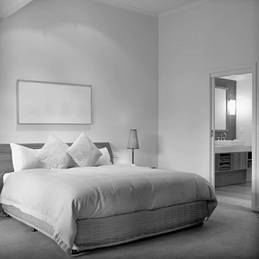

# Monocular-Depth-Estimation: The influence of Image Augmentation on state-of-the-art depth estimators

In this repository is the complementary code to the work presented in [the report](https://github.com/LeonardoPohl/Monocular-Depth-Estimation--The-influence-of-Image-Augmentation-on-state-of-the-art-depth-estimators/blob/master/docs/Monocular_Depth_estimation_using_proecessed_images.pdf) and [the presentation](https://github.com/LeonardoPohl/Monocular-Depth-Estimation--The-influence-of-Image-Augmentation-on-state-of-the-art-depth-estimators/blob/master/docs/MIR%20Final.pdf).

Additionally to comparing GLPN and NeWCRFs, we also applied image augmentation which can be seen here:

||Original|Grey scale|Desaturated|Oversaturated|Edge Detection|Edge Detection (>2% White threshold) and Colour|Edge Detection (>20% White threshold) and GreyScale|Edge Detection (>2% White threshold) and Greyscale|Edge Detection (>20% White threshold) and Greyscale|
|-|-|-|-|-|-|-|-|-|-|
|Sample Image|
|||||||||

## Prerequisits

To use the code in the code directory please follow the following instructions:

1. Download and Paste into `sourcefiles/Code/checkpoints`
   - https://virutalbuy-public.oss-cn-hangzhou.aliyuncs.com/share/newcrfs/models/model_nyu.ckpt
   - https://virutalbuy-public.oss-cn-hangzhou.aliyuncs.com/share/newcrfs/models/model_kittieigen.ckpt
2. Download and extract the subfolders (not sync itself) into `sourcefiles/data/nyu`
   - https://drive.google.com/file/d/1AysroWpfISmm-yRFGBgFTrLy6FjQwvwP/view
3. Run `sourcefiles/data/KITTI/raw_data_downloader.sh`, which will download the files into `sourcefiles/data/KITTI/2011_09_26`. 
   - The code was only written to use the drives on that day up to drive 36. So you can either interrupt the scipt once it reaches past 36, or adapt the code to read the files automatically.
4. Create an account (or login with an existing one) on http://www.cvlibs.net/datasets/kitti/user_login.php and download and extract the folders into `sourcefiles/data/KITTI/`
   - http://www.cvlibs.net/datasets/kitti/eval_depth.php?benchmark=depth_prediction

Sorry for not automating this.

Please change into the `sourcefiles` directory and refer to the [README](https://github.com/LeonardoPohl/Monocular-Depth-Estimation--The-influence-of-Image-Augmentation-on-state-of-the-art-depth-estimators/blob/master/sourcefiles/README.md) there.